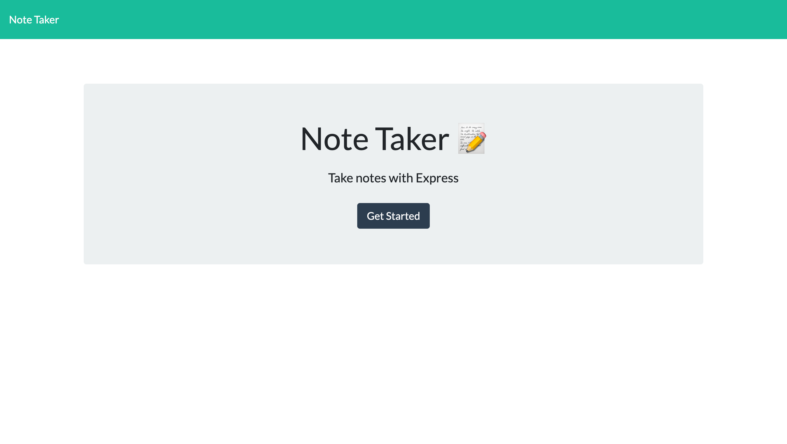
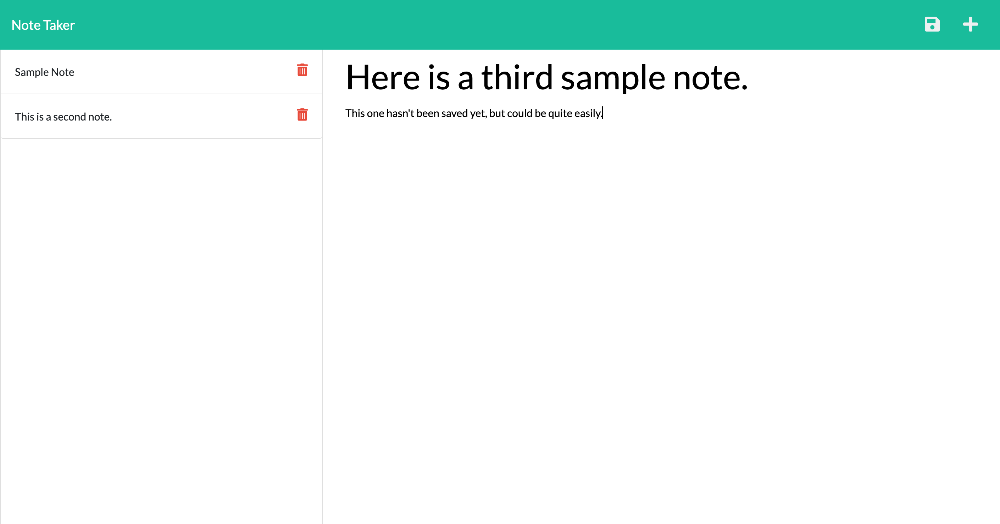
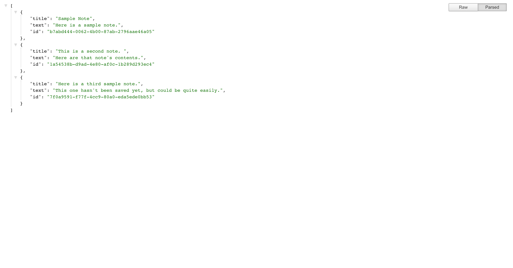

# Note Taker

## Description
This application permits users to create, save, and delete notes for later use.

## Table of Contents
- [Usage](#usage)
- [Credits](#credits)
- [Features](#features)
- [Questions, Comments, Suggestions](#questions-comments-suggestions)

## Usage
[Visit this application on Heroku](https://damp-cliffs-49241.herokuapp.com/) to create, save, and delete notes.

 ## Features
 - [Heroku](https://dashboard.heroku.com/)
 - [Node.js](https://nodejs.org/en/)
 - [Express.js](https://expressjs.com/)
 - [uuid](https://www.npmjs.com/package/uuid)

## Screenshots of Application
### Homepage

### Notes Interface with Sample Notes

### Notes API with Sample Notes

## Credits
### Developed By
- [Ryan Campbell, Back-End Developer](https://www.github.com/rrcampbell-exe/)

## Questions, Comments, Suggestions
Please email [Ryan Campbell](mailto:campbell.ryan.r@gmail.com) with any questions, to report any bugs, or to make any feature suggestions. You can also [contact Ryan Campbell on GitHub](https://www.github.com/rrcampbell-exe/).

This README was generated by [Ryan R. Campbell's](https://www.github.com/rrcampbell-exe/) [README Generator](https://github.com/rrcampbell-exe/readme-generator).